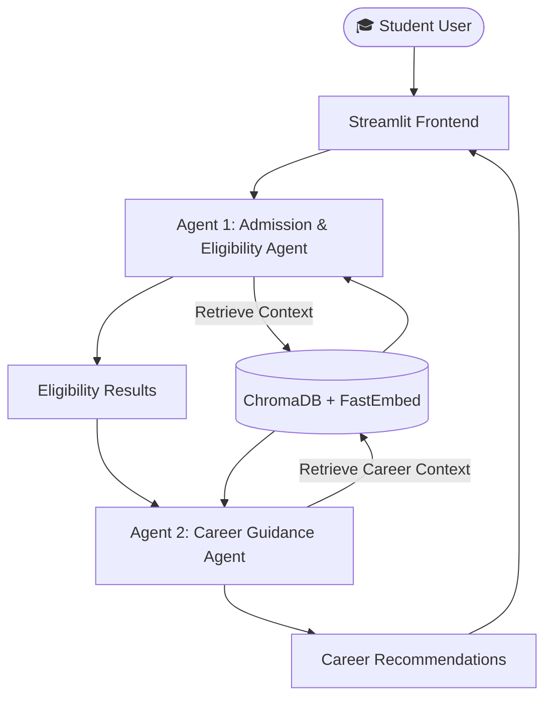
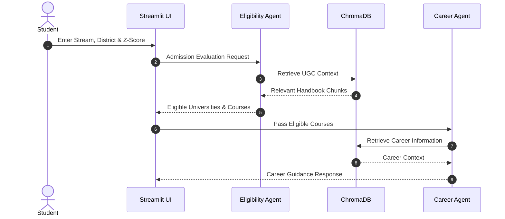

# 🎓 Lanka Campus Navigator

> **Agentic AI & RAG System for Sri Lankan UGC Campus Admission Eligibility & Career Guidance**

[](https://lanka-campus-navigator.streamlit.app/)
[](https://www.python.org/downloads/)
[](https://groq.com/)

---

# 📌 Project Overview

**Lanka Campus Navigator** is an Intelligent Agentic AI system built to assist G.C.E. Advanced Level students in Sri Lanka. Navigating UGC admission cut-off Z-scores, eligible university courses, required aptitude tests, and career prospects is often complex.

This application uses a Retrieval-Augmented Generation (RAG) pipeline over official UGC Handbooks alongside a multi-agent workflow to automate eligibility checks and provide personalized career guidance.

---

# 🏗️ System Architecture & Workflow

## 1. High-Level Architecture Diagram



---

## 2. Agent-to-Agent Communication Sequence



---

# 🤖 Agentic Design Patterns

This project implements **three Agentic AI design patterns** required by the assignment.

## 1. Router Pattern

- Uses **Llama-3.1-8B-Instant**
- Detects user intent
- Routes requests to the correct prompt template

---

## 2. Tool Use Pattern

The agents use a retrieval tool (`retrieve_context()`) that performs semantic similarity search on a **ChromaDB Vector Database** built from the official Sri Lankan UGC Handbook.

---

## 3. Reflection / Critique Pattern

Responses generated by the reasoning model are validated against retrieved context before being shown to the user, improving factual accuracy.

---

# 📊 Model Selection Strategy

| Task | Model | Reason |
|------|-------|--------|
| Intent Routing | Llama-3.1-8B-Instant (Groq) | Fast and low latency |
| RAG Reasoning | Llama-3.3-70B-Versatile (Groq) | Better reasoning and contextual understanding |

---

# 📚 RAG Pipeline

### Knowledge Base

- Official Sri Lankan UGC Handbook
- District-wise Z-Score data
- Aptitude Test information

---

### Chunking Strategy

- RecursiveCharacterTextSplitter
- Chunk Size: **500**
- Chunk Overlap: **80**

---

### Embedding Model

```
FastEmbedEmbeddings
BAAI/bge-small-en-v1.5
```

---

### Vector Database

```
ChromaDB
```

---

## Sample Retrieval Evaluation

| Sample Query | Result |
|--------------|--------|
| Physical Science 1.80 Kandy | Highly Relevant |
| Medicine Badulla | Highly Relevant |
| Architecture Aptitude Test | Highly Relevant |
| Arts Career Paths | Relevant |
| Commerce IT Degree | Relevant |

---

# 🛠️ Local Setup

## 1. Clone Repository

```bash
git clone https://github.com/dilsharadissanayake0-dev/Lanka-Campus-Navigator.git

cd Lanka-Campus-Navigator
```

---

## 2. Install Dependencies

```bash
pip install -r requirements.txt
```

---

## 3. Configure Environment Variables

Create a **.env** file.

```env
GROQ_API_KEY=your_groq_api_key_here
```

---

## 4. Build the Vector Database

```bash
python rag_pipeline.py
```

---

## 5. Run the Application

```bash
streamlit run app.py
```

---

# ⚠️ Known Limitations

- UGC cut-off marks change annually and require re-indexing.
- Special quota admissions still require manual verification using official UGC publications.
- Career recommendations depend on the available handbook content.

---

# 🚀 Technologies Used

- Python
- Streamlit
- LangChain
- ChromaDB
- FastEmbed
- Groq API
- Llama-3.1-8B-Instant
- Llama-3.3-70B-Versatile

---

# 👨‍💻 Developed By

**Dilshara Dissanayake**
ITBIN-2313-0030
